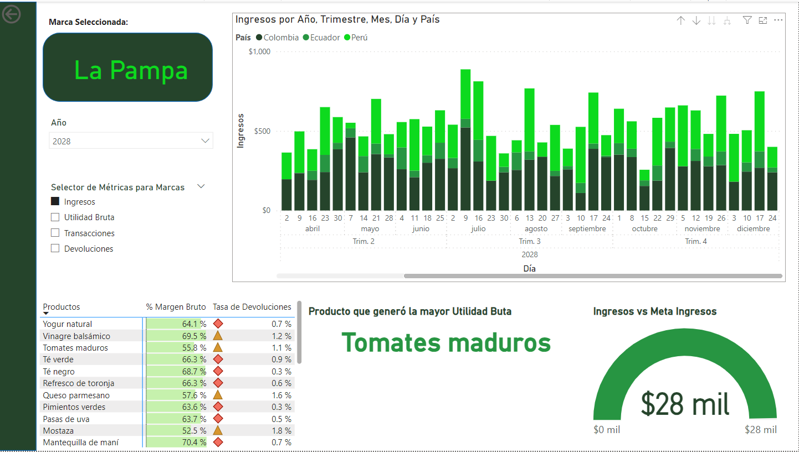

# Página de Informe "Marcas" en Power BI

En esta sesión, crearás la página "Marcas" del informe. Particularmente, deberás hacer uso de la herramienta de **Desagregación Transversal (Drillthrough)** para filtrar una marca particular desde el Resumen Ejecutivo, permitiendo un análisis detallado por marca.

---

## Paso 1: Configuración Inicial

1.  **Crea una Nueva Página:**
    * Abre tu proyecto existente en Power BI Desktop.
    * Agrega una nueva página seleccionando el ícono `+` al final de las pestañas de página.
    * Nombra esta página "**Marcas**".

---

## Paso 2: Configurar Navegación y Filtros

1.  **Configura la Desagregación Transversal (Drillthrough):**
    * Asegúrate de que, en la página "**Resumen Ejecutivo**", puedas hacer clic derecho en una marca específica en la matriz de marcas y seleccionar "**Desagregación transversal**" (o "Drillthrough") a la página "**Marcas**".
    * Esto permitirá una navegación fluida y directa a la información detallada de una marca seleccionada.
2.  **Filtro Provisional de Marca:**
    * En la página "**Marcas**", agrega un **filtro provisional para "Marca"** mientras configuras el informe. Este filtro será reemplazado más adelante.
3.  **Filtro por Año:**
    * Agrega un **filtro de página** que solo muestre datos del año seleccionado (por ejemplo, el año 2028), asegurando que los análisis sean relevantes para el período de tiempo específico.

---

## Paso 3: Crear Visualizaciones

1.  **Selector de Métricas (Parámetro de Campos):**
    * Crea un **selector de métricas** que permita elegir entre:
        * **Ingresos**
        * **Utilidad Bruta**
        * **Transacciones**
        * **Devoluciones**
    * Este selector modificará las visualizaciones según la métrica seleccionada.
2.  **Gráfico de Áreas o Columnas Apiladas:**
    * Decide entre un gráfico de **áreas** o **columnas apiladas**.
    * Configura el eje X con "**Inicio de Semana**".
    * Configura el eje Y para mostrar los valores basados en el **selector de métricas**.
    * Usa "**Países**" en la leyenda para apilar los datos por Colombia, Ecuador y Perú.
3.  **Matriz de Indicadores Clave:**
    * Crea una **matriz** que muestre `"% Margen Bruto"` y la `"Tasa de Devoluciones"`.
4.  **Reutilización del Gráfico de Medidor:**
    * Recicla el **gráfico de medidor de "Ingresos vs. Meta de Ingresos"** de la página "**Resumen Ejecutivo**".
    * Configúralo para que refleje la información **filtrada por marca y producto seleccionado** desde la matriz.
5.  **Tarjeta de Producto de Mayor Utilidad Bruta:**
    * Añade una **tarjeta** que muestre el producto que generó la **mayor utilidad bruta** en el período analizado.
    * Deja un espacio debajo de esta tarjeta para uso futuro en tareas adicionales.

---

## Paso 4: Validación y Formato

1.  **Prueba la Desagregación Transversal:**
    * Desde la página "**Resumen Ejecutivo**", prueba la funcionalidad de desagregación transversal asegurándote de que filtra correctamente en la página "**Marcas**".
2.  **Sustitución del Filtro Provisional:**
    * Una vez confirmado que todo funciona como se espera, sustituye el filtro provisional por una **tarjeta que muestre la marca seleccionada** a través de la desagregación transversal.
3.  **Formateo Final:**
    * Personaliza las visualizaciones y el layout de la página "**Marcas**" según tus gustos y preferencias. Asegúrate de que el diseño sea limpio, profesional y fácil de entender.

---

### Nota Adicional:

Se proporciona una imagen de muestra. No es necesario seguirla al pie de la letra; de hecho, se prefiere que elabores el informe de acuerdo a tus propios gustos y preferencias, incluso creando nuevas medidas si así lo deseas.

---

### Preguntas de esta tarea:

* **Comparte una imagen de la página "Marcas" de tu informe:**