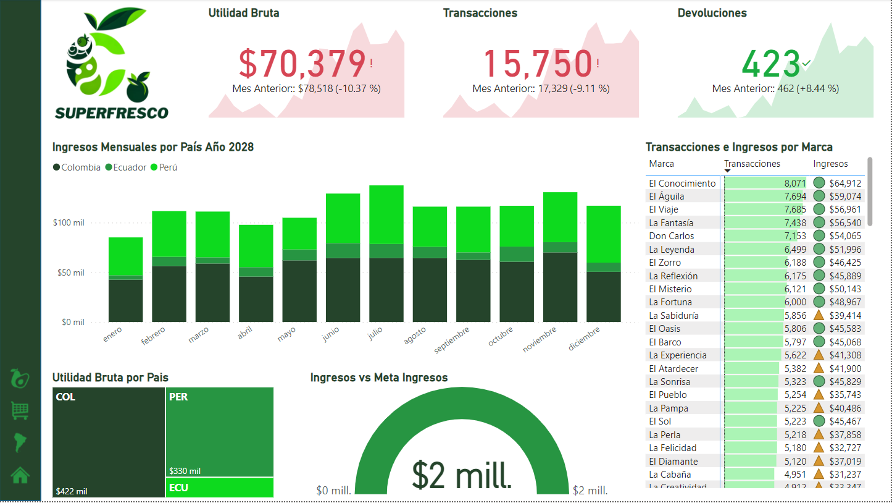

# Creación de una Barra de Navegación Funcional en Power BI

En esta tarea, crearás una barra de navegación funcional en Power BI que utilizarás en todas las páginas de tu informe para mejorar la experiencia del usuario.

---

## Paso 1: Preparación

1.  **Crea una Nueva Página:**
    * Abre tu proyecto en Power BI Desktop.
    * Agrega una nueva página seleccionando el ícono `+` al final de las pestañas de página.
    * Nombra esta nueva página como "**Barra de Navegación**".

---

## Paso 2: Configuración de Iconos

1.  **Descarga y Prepara los Iconos:**
    * Descarga el archivo zip proporcionado con los iconos predeterminados.
    * **Opcional:** Puedes crear tu propio set de iconos para los estados "valor predeterminado" y "al pasar el cursor". Asegúrate de que los iconos sean claros y tengan un diseño coherente.

---

## Paso 3: Insertar y Personalizar Botones

1.  **Inserta Botones en la Página:**
    * En Power BI, utiliza la opción "**Botones**" en el panel de visualizaciones para insertar **4 botones en blanco** en la página.
2.  **Personaliza cada botón utilizando los iconos que preparaste o descargaste.** Para cada botón:
    * Haz clic en el botón para seleccionarlo.
    * Ve al panel de formato (icono de pincel) y selecciona "**Icono**" dentro de las opciones del botón.
    * Establece el icono para el estado "**valor predeterminado**" y ajusta la configuración para "**al pasar el cursor**" si deseas que el icono cambie.

---

## Paso 4: Probar Funcionamiento

1.  **Configura la Acción de los Botones:**
    * Cada botón debe tener una acción configurada, típicamente para navegar a una página específica del informe. Configura esto en las opciones de formato del botón bajo "**Acción**".
    * Prueba cada botón haciendo clic en el modo de visualización (Ctrl + Clic en Power BI Desktop) para asegurarte de que te lleva a la página correcta.

---

## Paso 5: Agrupar y Clonar la Barra de Navegación

1.  **Agrupa los Botones:**
    * Selecciona todos los botones que has creado (mantén presionada la tecla `Shift` y haz clic en cada botón).
    * Haz clic derecho sobre ellos y selecciona "**Agrupar**".
2.  **Copia y Pega la Barra de Navegación en Cada Página:**
    * Con los botones aún seleccionados y agrupados, copia el grupo.
    * Navega a cada una de las otras páginas de tu informe y pega el grupo en una posición consistente, idealmente en la misma ubicación en cada página para mantener una experiencia de usuario coherente.

---

Esta tarea no solo mejorará la navegación dentro de tu informe, sino que también te proporcionará práctica en personalizar y manipular objetos de visualización en Power BI. ¡Buena suerte!

---

### Nota Adicional:

Se comparte una imagen de muestra de una barra de navegación como guía.

---

### Preguntas de esta tarea:

* **Comparte una imagen de tu barra de navegación (si lo deseas):**
* **Descargar archivos de recursos** (Este punto indica que se te proporcionará un archivo zip aparte con los iconos).