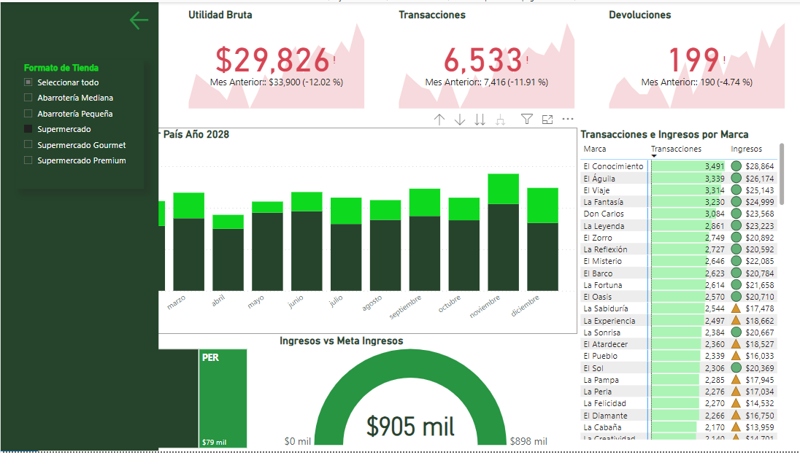

# Creación de un Panel de Segmentación Dinámico en Power BI

En esta tarea, crearás un panel de segmentación interactivo que no solo mejorará la navegación y la interactividad de tu informe, sino que también te proporcionará una valiosa práctica en el uso avanzado de visualizaciones y la personalización de la experiencia del usuario en Power BI.

---

## Paso 1: Preparación y Configuración Inicial

1.  **Crea un Botón para el Panel de Segmentación:**
    * Utiliza los iconos de filtro proporcionados en la sección de recursos o crea y personaliza tus propios iconos.
    * Inserta un botón en tu informe y configúralo con el icono de filtro seleccionado. Este botón servirá para "mostrar" el panel.

---

## Paso 2: Diseñar el Panel de Segmentación

1.  **Crear el Fondo del Panel:**
    * Inserta una forma **rectangular** en la página donde desees colocar el panel de segmentación. Este servirá como fondo del panel.
    * Ajusta el tamaño y el color de la forma para que se adapte al diseño y tamaño del panel que necesitas.

---

## Paso 3: Agregar y Configurar Segmentadores

1.  **Insertar Segmentador por Tipo de Tienda:**
    * Agrega un **segmentador** a tu panel que filtre los datos por `"tipo_tienda"`.
    * **Opcional:** Renombra este segmentador como "**Formato de Tienda**" para que sea más claro para los usuarios qué están seleccionando.

---

## Paso 4: Botón para Esconder el Panel

1.  **Inserta un Botón para Esconder el Panel:**
    * Agrega un segundo botón que se utilizará para esconder el panel de segmentación.
    * Personaliza este botón con un icono que represente esconder el panel, como una flecha hacia la izquierda.

---

## Paso 5: Formateo de Elementos

1.  **Da Formato a los Elementos del Panel:**
    * Asegúrate de que todos los elementos dentro del panel (fondo, segmentadores, botones) tengan un diseño y formato coherentes.
    * Ajusta tamaños, colores y tipografías según sea necesario para que el panel sea visualmente atractivo y fácil de usar.

---

## Paso 6: Agrupar y Nombrar Elementos

1.  **Agrupa los Elementos del Panel:**
    * Selecciona todos los elementos que conforman el panel de segmentación y **agrúpalos**.
    * Renombra el grupo como "**Panel de Segmentación**".

---

## Paso 7: Configurar Marcadores

1.  **Crear Marcadores para Mostrar y Esconder el Panel:**
    * Crea un marcador llamado "**Mostrar Panel**" cuando el panel de segmentación esté visible.
    * Crea un segundo marcador llamado "**Esconder Panel**" cuando el panel esté oculto.
    * **Asegúrate de deshabilitar la opción "Datos" en ambos marcadores** para que no reseteen las selecciones hechas por el usuario en el segmentador.

---

## Paso 8: Asignar Marcadores a Botones

1.  **Asigna los Marcadores a los Botones Correspondientes:**
    * Configura el botón del filtro (el del Paso 1) para activar el marcador "**Mostrar Panel**".
    * Configura el botón de esconder (el del Paso 4) para activar el marcador "**Esconder Panel**".

---

## Paso 9: Pruebas Finales

1.  **Prueba la Funcionalidad del Panel:**
    * Asegúrate de que los botones de mostrar y esconder funcionen correctamente y que el panel de segmentación se muestre y oculte como se espera.
    * Verifica que los segmentadores filtren adecuadamente los datos sin resetear las selecciones cuando se muestra u oculta el panel.

---

Este panel de segmentación no solo mejorará la navegación y la interactividad de tu informe, sino que también te proporcionará una valiosa práctica en el uso avanzado de visualizaciones y la personalización de la experiencia del usuario en Power BI.

---

### Nota Adicional:

Se comparte una imagen de referencia por si te sirve de guía.

---

### Preguntas de esta tarea:

* **Comparte una imagen donde se aprecie tu panel de segmentación:**
* **Descargar archivos de recursos** (Este punto indica que se te proporcionará un archivo zip aparte con los iconos).