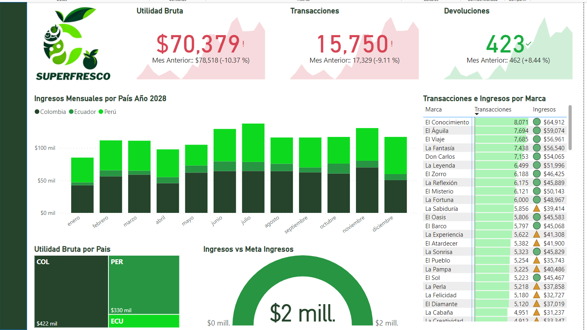

# Tarea: Dashboard de Resumen Ejecutivo de SuperFresco

Este proyecto tiene como objetivo la creación de una vista rápida y efectiva de los **KPIs clave**, las **tendencias de ingresos** y las **métricas de rendimiento** para SuperFresco en Power BI. Esta guía sirve como punto de partida; siéntete libre de modificar o agregar cualquier elemento para adaptarlo a tus preferencias.

---

## Paso 1: Configuración Inicial

Crea una nueva página en tu informe de Power BI y nómbrala "**Resumen Ejecutivo**".

---

## Paso 2: Diseño y Estructura

### Barra de Navegación
Inserta una barra de forma rectangular en la parte izquierda del dashboard. Ajusta su ancho a aproximadamente **60 píxeles** y elige un color que complemente el diseño (por ejemplo, un tono de verde si deseas seguir la paleta sugerida).

### Logo de SuperFresco
Descarga el **logo de SuperFresco** desde la sección de recursos y colócalo en la parte superior de la barra de navegación.

---

## Paso 3: Visualizaciones de Datos

### Tarjetas de KPI
En la parte superior del dashboard, crea tres tarjetas KPI que muestren:
* **Utilidad Bruta**
* **Total de Transacciones**
* **Total de Devoluciones**

Asegúrate de que estas métricas sean fácilmente visibles y estén correctamente formateadas.

### Gráfico de Barras Apiladas
Agrega un gráfico de barras apiladas que muestre los **Ingresos Mensuales por País**. Configura un filtro para mostrar solo los datos del **año 2028**.

### Matriz de Transacciones e Ingresos por Marca
En la parte derecha del dashboard, inserta una matriz que liste las **transacciones e ingresos por marca**. Aplica formato condicional para mejorar la visualización y ordena las marcas de forma descendente por Transacciones.

### Treemap de Utilidad Bruta por País
En la parte inferior izquierda, agrega un Treemap que visualice la **utilidad bruta por país**, también filtrado para el **año 2028**. (Puedes optar por un gráfico de pastel o de anillo si lo prefieres).

### Gráfico de Velocímetro de Ingresos vs. Meta de Ingresos
Finalmente, agrega un gráfico de velocímetro que compare los **Ingresos actuales** contra la **Meta de Ingresos**. Este tipo de visualización es efectiva para mostrar rápidamente qué tan cerca estás de alcanzar los objetivos financieros.

---

## Paso 4: Personalización y Creatividad

### Paleta de Colores
Aunque la sugerencia inicial utiliza verde para alinearse con el logo de SuperFresco, te animamos a elegir la **paleta de colores** que mejor se adapte a tu diseño o la que prefieras para tu dashboard.

### Referencia Visual
Se proporciona una imagen de ejemplo de cómo podría lucir un dashboard basado en estas instrucciones. Recuerda que este es solo un punto de partida y que debes sentirte libre de innovar y personalizar tu propio dashboard.

---

### Preguntas de esta tarea:

* **Comparte una imagen de la página de Resumen Ejecutivo de tu Informe.**