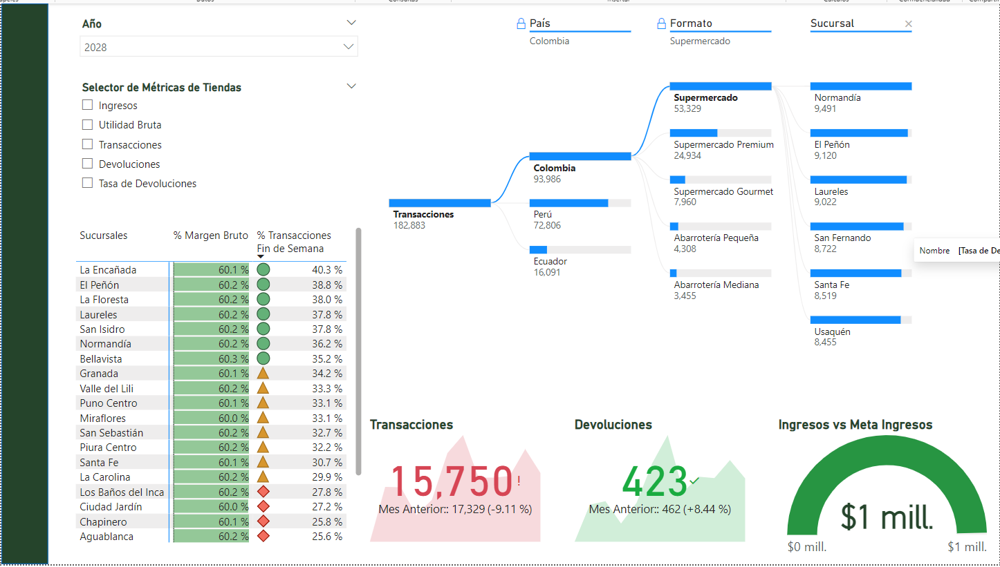

# Tarea: Informe Detallado de Operaciones de Tiendas SuperFresco

Este proyecto tiene como objetivo desarrollar una página de informe en Power BI que proporcione una vista detallada de las operaciones de las tiendas de SuperFresco, con un enfoque específico en ingresos, utilidades, transacciones y devoluciones, y cómo estos se distribuyen por país, tipo de tienda y sucursales específicas.

---

## Paso 1: Configuración Inicial del Informe

1.  **Crea una Nueva Página:**
    * Abre tu proyecto existente en Power BI Desktop.
    * Agrega una nueva página seleccionando el ícono `+` al final de las pestañas de página.
    * Nombra esta nueva página como "**Tiendas**".

---

## Paso 2: Agregar y Configurar Visualizaciones

1.  **Esquema Jerárquico:**
    * Inserta un gráfico de **esquema jerárquico** que desglose las tiendas por "**País**", "**Tipo de tienda**" y "**Sucursales**" (utiliza el campo `distrito_tienda`).
    * Asegúrate de que el gráfico permita una navegación fluida a través de las diferentes jerarquías.
2.  **Selector de Métricas:**
    * Crea un **selector de métricas** que permita cambiar entre:
        * **Ingresos**
        * **Utilidad Bruta**
        * **Transacciones**
        * **Devoluciones**
        * **Tasa de Devoluciones**
    * Implementa este selector para que afecte el gráfico jerárquico, permitiendo visualizar las métricas seleccionadas.
3.  **Filtro de Página por Año:**
    * Agrega un **filtro de página** y configúralo para el **año 2028**, asegurándote de que todas las visualizaciones en la página reflejen datos de este año específicamente.
4.  **Matriz de Sucursales:**
    * Inserta una **matriz** con "**Sucursales**" en las filas.
    * Añade `"% Margen Bruto"` y `"% Transacciones Fin de Semana"` en las columnas, proporcionando un análisis detallado por sucursal.
5.  **KPIs para Transacciones y Devoluciones:**
    * Añade **visualizaciones de KPI** que muestren las **transacciones y devoluciones totales**. Considera reutilizar o adaptar los KPIs creados previamente para el "Resumen Ejecutivo".
6.  **Gráfico de Medidor para Ingresos vs. Metas de Ingresos:**
    * Incorpora un **gráfico de medidor** que compare los ingresos actuales con las metas establecidas. Este gráfico debe actualizar su información al seleccionar diferentes sucursales o segmentaciones dentro del informe.

---

## Paso 3: Interactividad y Pruebas

1.  **Interacción entre Visualizaciones:**
    * Comprueba que la selección de una sucursal en el esquema jerárquico o en la matriz filtre y actualice los datos en los KPIs y en el gráfico de medidor.

---

## Paso 4: Personalización y Formato

1.  **Personaliza los Gráficos:**
    * Aplica formatos a los gráficos según tus preferencias de diseño, incluyendo colores, tipos de letra y otros elementos estéticos para que el informe sea visualmente atractivo y coherente.

---

## Paso 5: Guardar y Revisar

1.  **Guarda y Revisa tu Trabajo:**
    * Guarda el informe y revísalo para asegurarte de que todas las configuraciones y visualizaciones funcionan como se espera. Haz ajustes si es necesario.

---

### Nota Adicional:

Se proporciona una imagen de muestra para referencia. Tienes total libertad para diseñar tu informe, incluso puedes crear nuevas métricas (a los estudiantes más avanzados se les reta a crear métricas como los ingresos o utilidades por metro cuadrado).

---

### Preguntas de esta tarea:

* **Comparte una imagen de la página "Tiendas" de tu informe:**